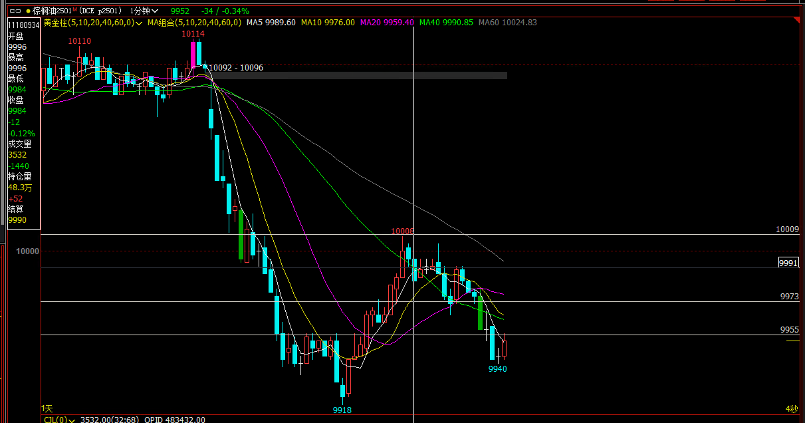
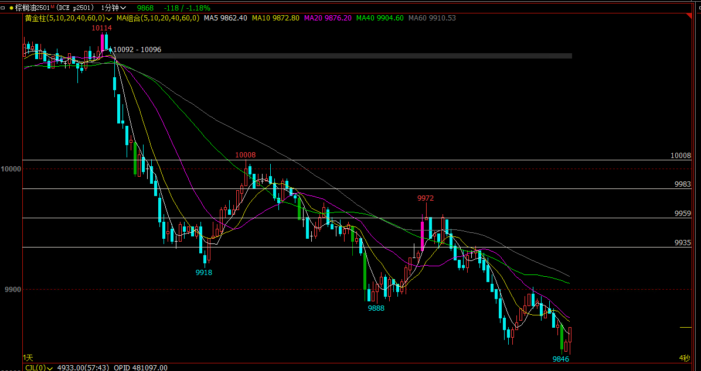
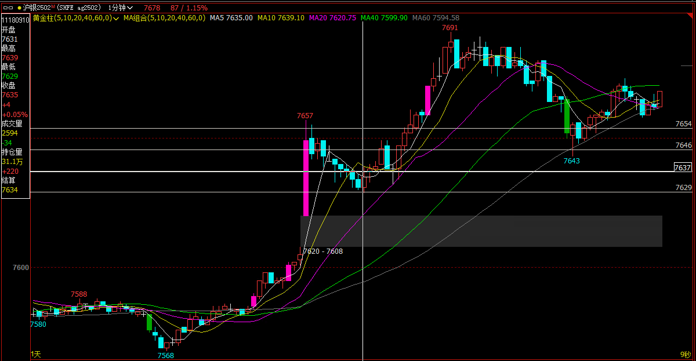
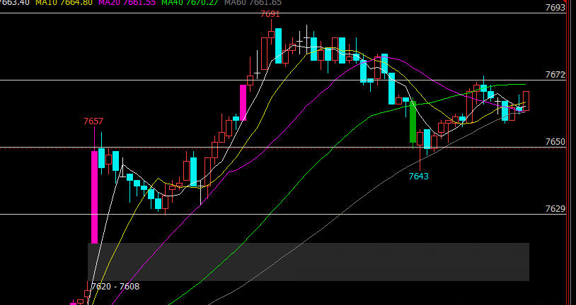
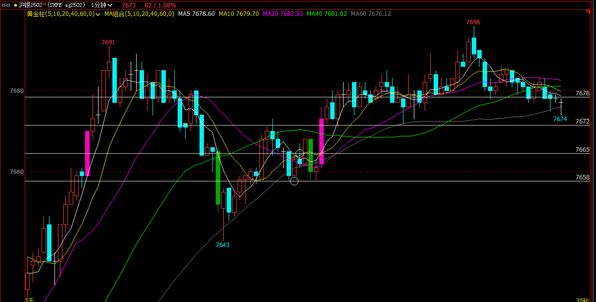
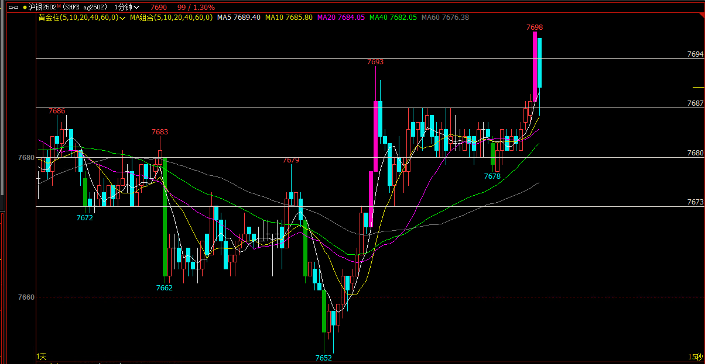
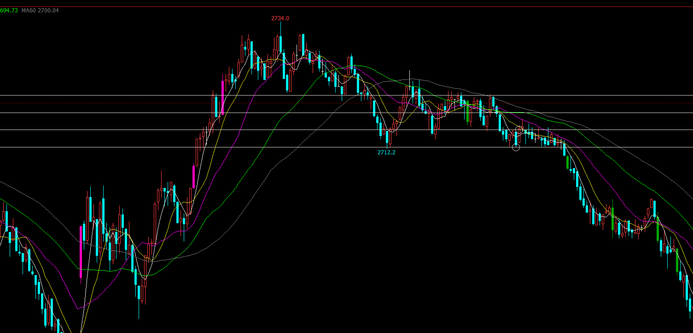

[toc]

### p2501

低1入场点，或低2入场点做空；拿2倍盈亏比

如果颈线入场，可拿1-2倍盈亏比，反弹3根阳线到绿均线，后一根阴线反转，止损移动到3根阳线上方，等待第二腿下跌

### ag2502

高开后大阳线，认为是突破后好的跟随，看多；回调后高1入场scalp；高2应该继续入场，突破颈线后MM测量，未到2倍盈亏比

深度回调后的第二入场点，期待下一波上涨；突破颈线后测量MM

2024-11-18 14:20 下图中空头反转，冲高回落到整个涨幅的一半位置，紧接一根阳线反转，阳线高点为高1买入点，后面有高2买入点，形成双底；买入后在窄区间内长时间震荡，7687多次尝试不能突破，然后向下尝试也失败，最后向上突破；只有坚定持有能才能拿到2倍盈亏比。打到2倍盈亏位置迅速回落

### IH2412 股指期货

小区间的底部找到高1买入点，但市场并未再次向上，而是缓慢向下测试底部支撑，然后直接向下突破; 所以这里做多是一笔失败的交易

