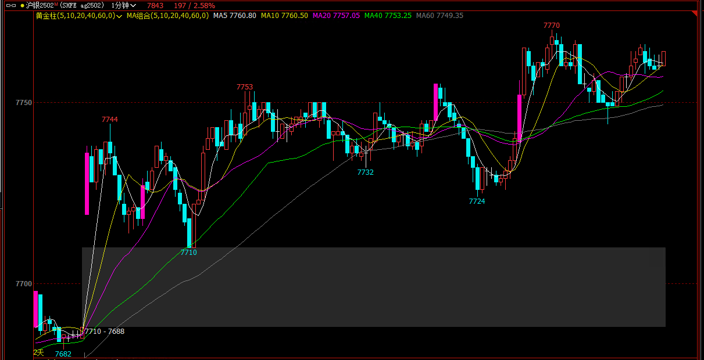
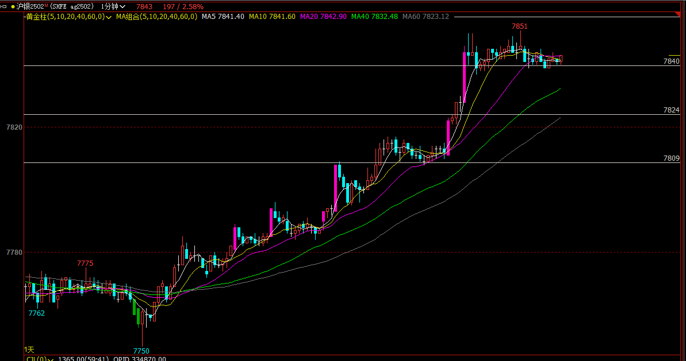

### ag2502

高开一涨一停，形成三推，此时追多错误。连续三根阴线回调到开盘价，依旧偏多头，此时追空也不好。再次一根入场k向上反转，此时在阳线收盘做多还可以，没有到达MM；随后向下反转，多头应该及时止损。明确了此时是震荡区间，随后向下突破要等待强信号，好的跟随，直接空不好。随后阳线向上反包，阳线入场做多，可以到达2倍盈亏。如果等到上涨3根阳线后再考虑入场，就会落入震荡区间，三根阳线又回到了区间顶部，在区间顶部做多不好。

向上突破到7753后回调，7753不应追多。随后进入震荡区间，应该低吸做scalp，不能追高，也不能做空。向下7734套住空头，此时阳线做多scalp似乎正确，但7734会被打止损，形成牛旗三推，随后再向上反转。做多等待高2入场更优。向上反转到区间顶部又向下。阳线反包后向上大阳线突破，但没有跟随，直接连续阴线向下突破，上方多头被套住。

向下突破追空，如果看到双底形成向上突破应该果断止损；随后大阳线向上反转，突破前方被套位置，多头全部解套，但向上突破没有跟随，形成头肩顶后阴线反包回调，两腿下跌，到40绿均线，然后向上反转，可以阳线入场。

突破回踩再向上，确认多头趋势可以坚定持有，可以拿到2倍盈亏比。

市场在后半夜形成宽幅三推下跌，非常难做。

早盘开盘，震荡区间，幅度很小10个点，难做。向下突破，2根大阴线，第三根下影线形成过程中被骗空，追空空头直接被套。随后向上反转到区间顶部，回调1根和向上突破区间，大阳线收在高位，认为多头趋势。回调到第二段涨幅的一半位置，继续向上，形成5推宽通道，低吸做多，追高不好。上涨一直踩20均线有效支撑。

进入震荡区间后，向上突破，一根大阳线，一根小阳线十字星，一般的跟随，十字星上方追做多，可以拿1+倍盈亏比。随后又进入横盘。

如果有深度回调，找入场点做多。如果直接向上突破，必须看到大阳线和好的跟随再追多。

