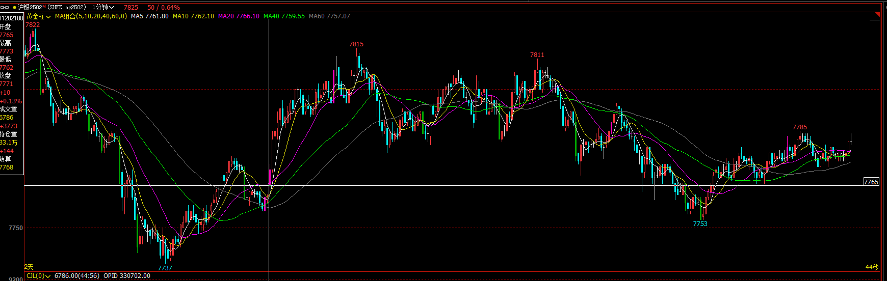
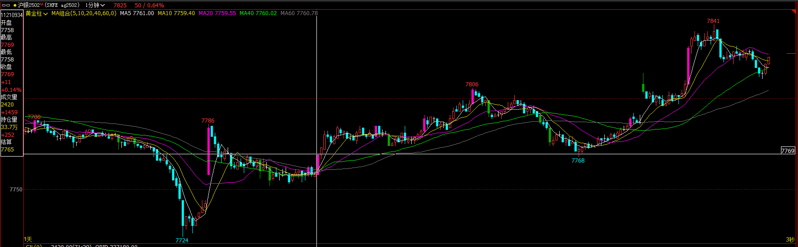
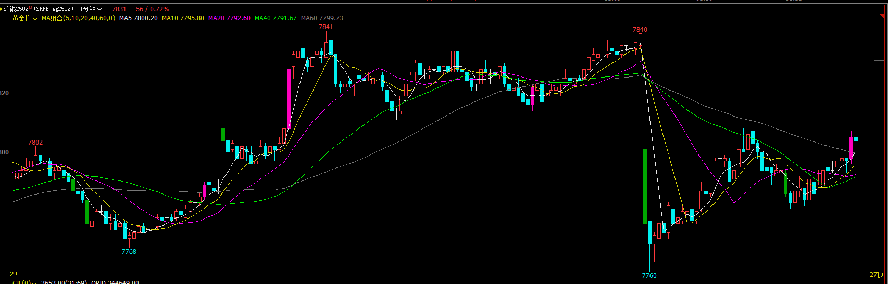

### ag2502

---

午后尾盘连续下跌来到大周期底部，形成反弹。晚上开盘连续大阳线，考虑在低位，加反弹背景，可以追多，能拿到MM一倍盈亏比，但走的不流畅，低点抬高但区间震荡，持仓不舒服。最后多次推动后一波抢购高潮，接类似ii形态形成反转，向下突破，可以突破空，1-2倍盈亏比

然后底部震荡，背景上涨回踩，不看空;形成双底，向上突破可以追多，但空间不大，有机会平推。然后震荡，多个第二段陷阱，边缘突破会被套。

7811后一段下跌到区间底部反弹，二次下跌突破区间底部，如果在第一段的低点挂stop追空可以有盈利，如果大阴线走完就没有再追空的机会，也可以看作是第二段陷阱。

然后向上反弹，但是比较弱，没有做多机会，然后直接向下反转，连续短阴线接大震荡，不好做。几波向下推动后向上反转，然后震荡向上，没有交易机会。

---

高开后大阳线突破，没有跟随，阴线回踩，然后区间震荡向下，重叠较多，更大周期是区间底部倾向看多，宽通道期待向上反转，最后一根大阳线突破，收盘收在最高，高1跳做多，阳线体积翻倍做MM，可以拿到1倍盈亏比。然后进入震荡，没有方向；在向上弱突破，没有交易机会。

7806处形成3推抢购高潮，接类似ii形态，是反转信号，向下突破是做空机会，但幅度不大，到均线受到阻力反弹，然后又向下反转，形成双顶，可以尝试空，小k线体积下跌，然后窄通道向下结束下跌，窄通道向上，没有交易机会。

---

下午开盘和早盘开盘有相同的形态，只是没有第一根大阳线；高开震荡向下，向上反转突破可以做多。一根惊喜k线，宽通道三推后结束上涨，阴线强势回踩，到均线有支撑，没有反弹，第二次回踩，3根不大不小的阴线形成第二段陷阱，阳线直接反转向上，不好交易，第一段做多会被套，第二段追空也会被套。
