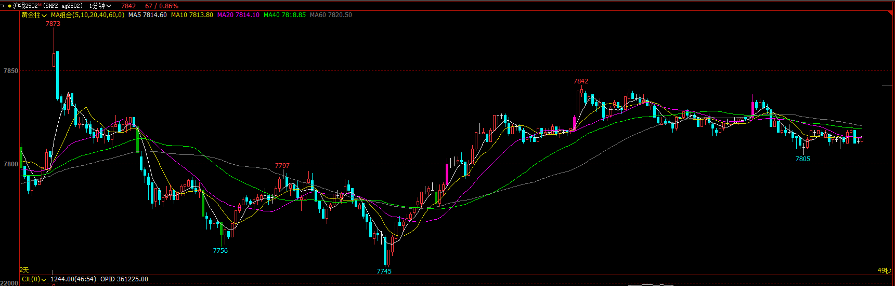
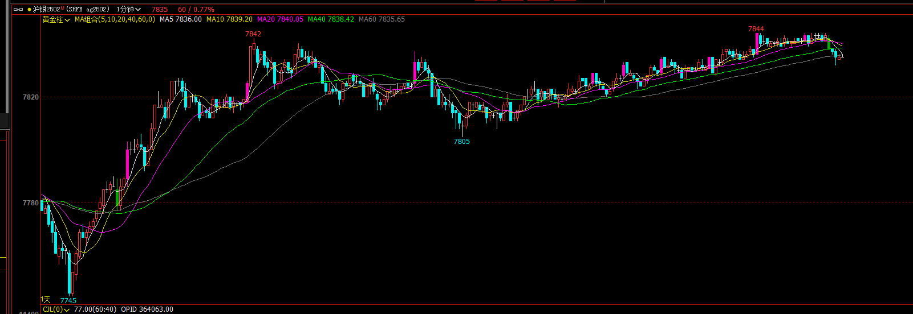

### ag2502

---

夜盘高开在高位，然后大阴线向下突破，第二段突破可以追空，震荡区间可以拿到一点收益；如果持仓坚定，可以拿到大的第二段下跌。

由于小第二段震荡3推向下，产生了反转的想法，看到比较大的阳线收在比较高的位置入场做多，期待有反转；但没有反转，直接向下突破，这是止损要非常果断。然后跟随大阴线直接追空，拿到一波下跌。

进入震荡区间，第三次向下突破考虑不追。在区间里面找低2入场空，期待第三次下跌；没有看到直接的下跌，就拿小的止盈出场了。如果第三波看到突破比较晚，则不应该追。

然后没有交易机会。7745是一波下跌突破失败，可以看作是大的第二段陷阱，又在大区间低位，向上强势反转后，可以考虑追多，如果能拿住，可以拿很多倍盈亏比。

---

向上第二次突破，如果入场早可以拿到收益，入场晚，就是第二段陷阱。走双顶之后向下，考虑做空，但市场没有向下，观察到没有强势突破，及时离场。离场后一根大阳线，类似ii结构，向下反转，由于之前看空，这次继续看空，在大阴线后stop order 入场空，但市场没有强势下跌，拿了几根小阴线后止盈。随后市场震荡向上。再没有交易机会。
